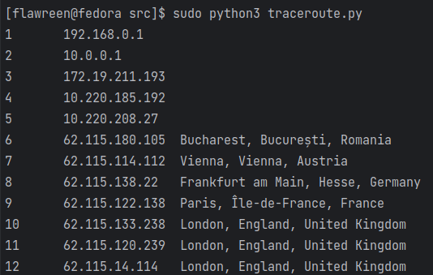
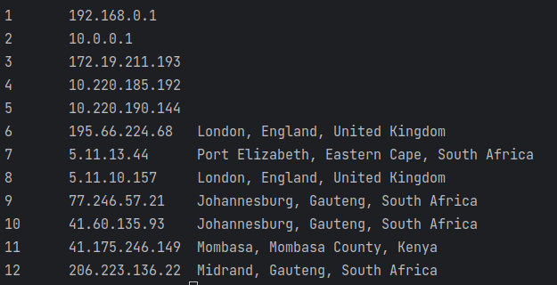
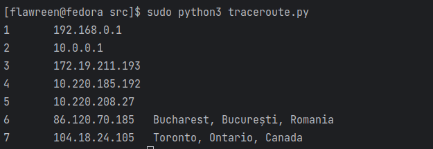
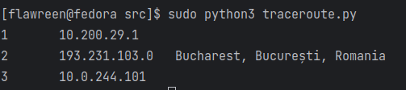
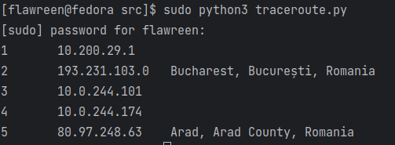
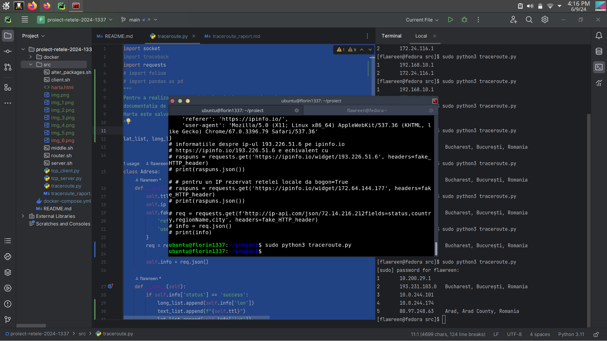

# Traceroute
## handmade traceroute in python with map visualization

### Afișați locațiile din lume pentru rutele către mai multe site-uri din regiuni diferite: din Asia, Africa și Australia căutând site-uri cu extensia .cn, .za, .au. Folositi IP-urile acestora.
### + Afișați: Orașul, Regiunea și Țara (acolo unde sunt disponibile) prin care trece mesajul vostru pentru a ajunge la destinație.
Am obtinut IP-urile domeniilor cu nslookup.io
#### 

#### Africa: coza.net.za - 196.29.59.26:33434

#### Australia: cpaaustralia.com.au - 104.18.24.105:33434

### Executați codul din mai multe locații: VPS creat la preambul, de la facultate, de acasă, de pe o rețea publică

#### De acasa
China: baidu.cn - 220.181.38.251:33434

#### De pe retea publica din mall
Africa: coza.net.za - 196.29.59.26:33434

Rusia: studyinrussia.ru - 37.18.87.162

#### De pe VPS

### Afișați rutele prin diverse țări pe o hartă folosind orice bibliotecă de plotare
Pentru a realiza harta am folosit biblioteca folium si am urmat
documentatia de la https://python-graph-gallery.com/312-add-markers-on-folium-map/
Harta este salvata intr-un fisier html harta.html

Adresa pe care am apelat traceroute pentru harta din git:
China: baidu.cn - 220.181.38.251:33434

